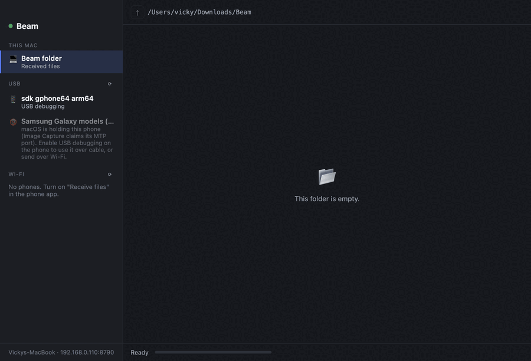
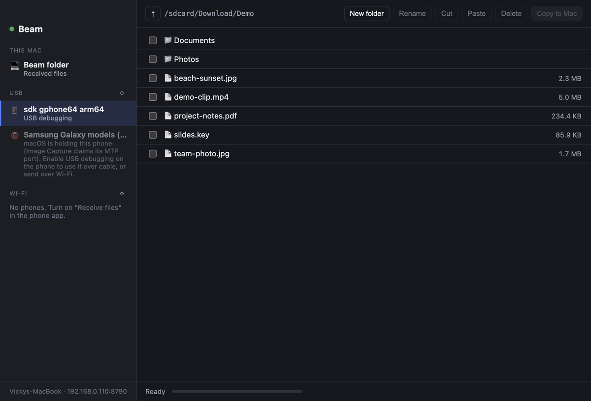
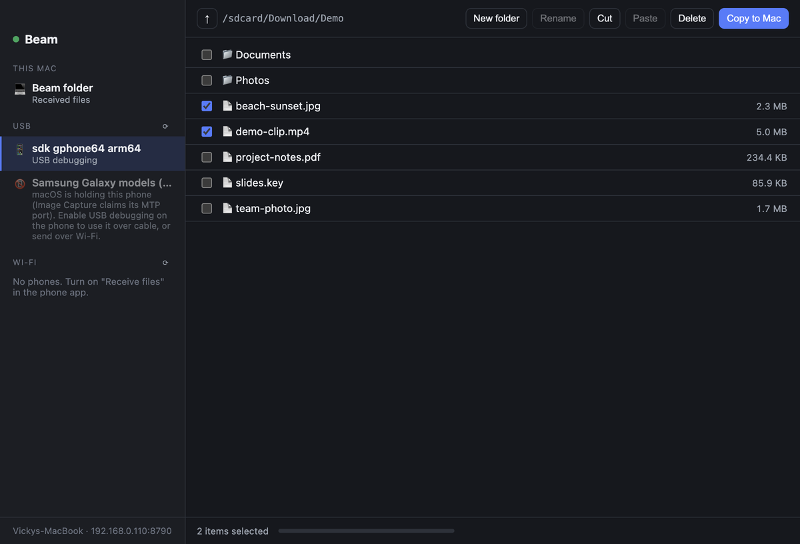
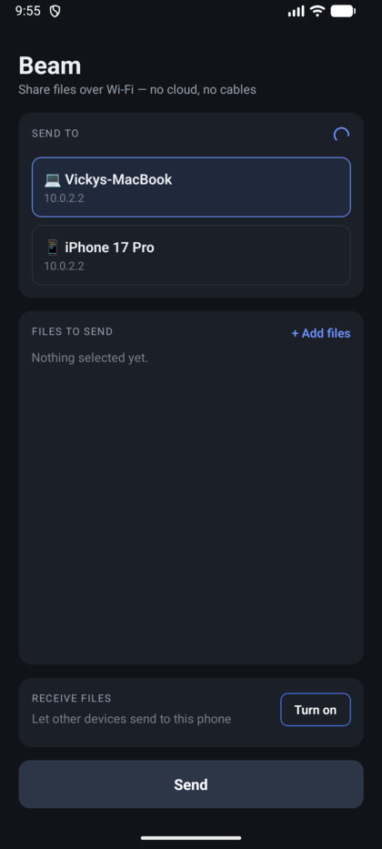
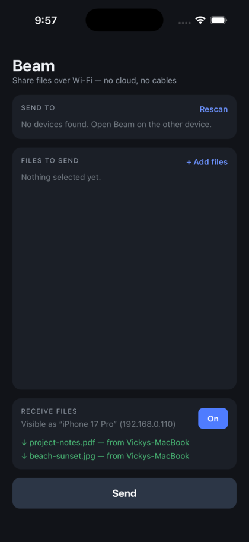
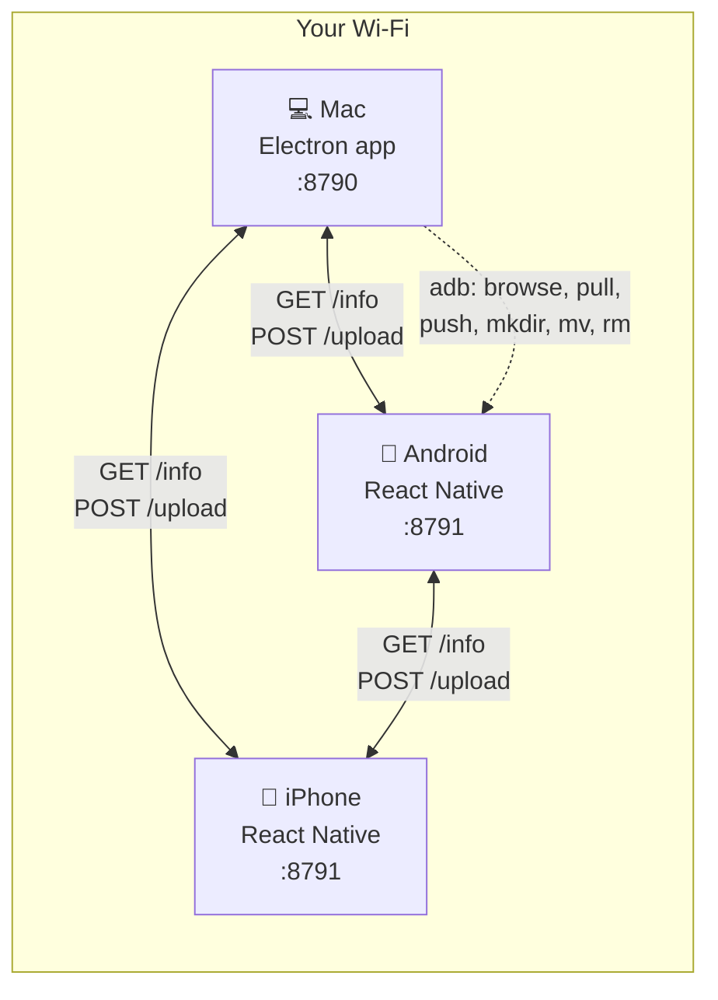

<div align="center">

# Beam

**Move files between your phone and your laptop — over Wi-Fi or a USB cable.
No cloud, no account, no upload limits.**

[](#install)
[](#the-mobile-app)
[](#how-it-works)
[](LICENSE)



*Browsing a connected phone and copying files to the Mac — the whole round trip.*

</div>

---

## Why I built this

Getting a file off an Android phone onto a Mac is genuinely annoying. Google's
**Android File Transfer was discontinued**, AirDrop doesn't speak to Android,
and everything else wants you to upload a private file to somebody's server and
download it again — slow, and a strange thing to do with your own photos.

Beam does the obvious thing instead: your phone and your laptop are already on
the same Wi-Fi, so they should just talk to each other. And when they're joined
by a cable, that should work too.

**One file transfers in the time it takes a cloud app to finish uploading.**

## What it does

| | |
| --- | --- |
| 📶 **Wi-Fi transfer, both directions** | Phone → laptop and laptop → phone, over your local network. Devices find each other automatically. |
| 🔌 **USB cable mode** | Browse a connected Android like a drive and copy files either way. |
| 🗂 **Manage the phone's files** | Create folders, rename, move, delete — from your laptop. |
| 🖱 **Real drag and drop** | Drag files out of the phone into Finder; drag files from Finder onto the phone. |
| 🍎 **Works with iPhone too** | Over Wi-Fi. iOS gives no USB file access to anyone, so cable mode is Android-only. |
| 🔒 **Nothing leaves your network** | No server, no account, no telemetry. |

## Screenshots

### Desktop — a two-pane file manager

Devices on the left, an explorer on the right. Everything that's reachable
appears in one place: this Mac, phones on USB, and phones on Wi-Fi.



Phones that are plugged in but *not* usable don't silently disappear — they're
listed with the actual reason and what to do about it (that greyed-out Samsung
is a macOS restriction explained [below](#the-hard-part-macos-and-mtp)).



### Mobile — Android and iOS, one codebase

<p align="center">
  
  &nbsp;&nbsp;&nbsp;
  
</p>

Left: Android has found both the MacBook and the iPhone on the network.
Right: iOS in receive mode, showing files as they arrive.

## How it works

Every device speaks the same tiny HTTP protocol. There is no central server —
each device is both a client and a server.



**Two endpoints, that's the whole protocol:**

- `GET /info` → `{"app":"beam","name":"Vickys-MacBook","platform":"darwin"}`
- `POST /upload?from=<sender>` → a multipart file upload

**Discovery is a subnet sweep, deliberately.** A device reads its own Wi-Fi IP,
then probes `/info` on all 254 addresses of its `/24` in parallel. The obvious
alternative — mDNS/Bonjour — needs a different native library on every platform,
behaves differently on each, and is exactly the kind of dependency that breaks
six months later. A parallel HTTP sweep is a few dozen lines, has no
dependencies, and behaves identically on macOS, Android and iOS. It finishes in
about a second.

**Ports carry meaning:** `8790` = laptops, `8791` = phones. A scanner that finds
`8791` knows it found a phone before it parses anything.

### Project layout

```
beam/
├── desktop/          Electron app (the Mac side)
│   └── src/
│       ├── main.js       receiver, IPC, native drag, confirm dialogs
│       ├── cable.js      USB: adb + libmtp backends, file operations
│       ├── wifi-send.js  discovery sweep + upload
│       └── app.js        the two-pane UI
└── mobile/           React Native app (Android + iOS)
    ├── src/              discovery, upload, receiver bridge
    └── android|ios/      native receive-mode modules
```

The phone's receiver is native on both platforms — **NanoHTTPD** (Kotlin) on
Android, **GCDWebServer** (Objective-C) on iOS — bridged to one shared JS API,
so the React Native side stays identical across platforms.

## Install

### Desktop (macOS, Apple Silicon)

```bash
cd desktop && npm install && npm run dist
```

Open `desktop/release/Beam-0.1.0-arm64.dmg` and drag Beam to Applications.

> The build isn't code-signed (that needs a paid Apple Developer ID), so the
> first launch needs **right-click → Open**.

Or run it from source with `npm start`.

### The mobile app

```bash
cd mobile && npm install
npx react-native start          # Metro, in one terminal
npx react-native run-android    # in another
```

For iOS, install pods first — CocoaPods needs a UTF-8 locale or it crashes:

```bash
cd mobile/ios && LANG=en_US.UTF-8 pod install && cd .. && npx react-native run-ios
```

## Using it

**Over Wi-Fi:** open Beam on both devices, turn on *Receive files* on the phone,
and each shows up in the other's list. Pick files and send, or drag files onto
the laptop's drop zone.

**Over a cable:** connect an Android with **USB debugging** enabled. It appears
under *USB*, and the right pane becomes a file browser: tick files and
*Copy to Mac*, drag them into Finder, or drop files in to copy them the other
way.

**Managing phone files** (cable, USB debugging): *New folder*, *Rename*,
*Cut* → *Paste* to move, and *Delete*.

Because a phone has no trash, deleting is guarded: a confirmation names exactly
what will go with **Cancel** as the default, names are validated so a rename can
never escape its folder, nothing silently overwrites, and every path is
shell-quoted before it reaches `adb`.

## The hard part: macOS and MTP

The most interesting bug in this project wasn't in my code.

Android phones expose file transfer over **MTP**, and the plan was to use
`libmtp` so no phone setup was needed. On macOS it fails, and the failure is
worth understanding:

```
Device 0 (VID=04e8 and PID=6860) is a Samsung Galaxy models (MTP).
error returned by libusb_claim_interface() = -3
LIBMTP PANIC: Unable to initialize device
```

Most phones present their MTP endpoint as **USB interface class 6
(Still Image / PTP)** — the same class as a camera. macOS automatically binds
its own Image Capture daemons (`ptpcamerad`, `mscamerad-xpc`) to any class-6
interface, and **libusb cannot detach a kernel driver on macOS**. So the port is
taken before any app gets a look in. Quitting Android File Transfer doesn't help,
and the Apple daemons are SIP-protected — they respawn instantly if you kill
them. This is why Android File Transfer was always unreliable on a Mac.

`ioreg -p IOUSB -w0 -l` tells the story: the phone's interface is right there,
labelled `MTP@0` with `bInterfaceClass = 6`.

**The fix was product, not code.** Beam detects this exact failure and tells you
what's happening and what to do, instead of the empty file list that a naive
implementation shows. The `adb` backend then does the job properly for anyone
who turns on USB debugging.

> A lesson worth keeping: an error you can't fix is still worth *naming*
> precisely. "No files found" is a bug report; "macOS is holding this phone —
> here's the alternative" is a product.

## Honest limitations

- **Transfers are unauthenticated and unencrypted.** Anything on your Wi-Fi that
  finds the port can send you a file, and receivers accept silently. Fine on a
  home network, not on café Wi-Fi. Receiver approval and TLS are the next things
  to build.
- **Cable features need USB debugging**; MTP is read-only and blocked on macOS.
- **iPhones can't use USB at all** — Apple exposes no MTP or filesystem there.
- **Individual files only**; dragging whole folders isn't supported yet.
- **The Mac build is unsigned**, and only Apple Silicon is built today.
- iOS keeps its receiver running only while the app is in the foreground.

## What's verified

Every transfer path was checked with **matching MD5 checksums**, not just a
success message:

| Path | Result |
| --- | --- |
| Mac → Android (Wi-Fi) | ✅ checksum matched |
| Android → Mac (Wi-Fi) | ✅ checksum matched |
| Android → iPhone (Wi-Fi) | ✅ checksum matched |
| Mac → iPhone (Wi-Fi) | ✅ checksum matched |
| Mac ↔ Galaxy S23 (cable) | ✅ both directions, checksums matched |
| Phone file operations | ✅ on a physical Galaxy S23 |

## Roadmap

- [ ] Receiver approval prompt + pairing code
- [ ] TLS for transfers
- [ ] Copy/duplicate on the phone, and undo
- [ ] Folder drag-and-drop
- [ ] Code-signed and notarised Mac build, Windows and Linux builds

---

<div align="center">

Built with Electron, React Native, and a deep dislike of uploading my own photos
to somebody else's computer.

MIT licensed — see [LICENSE](LICENSE).

</div>
